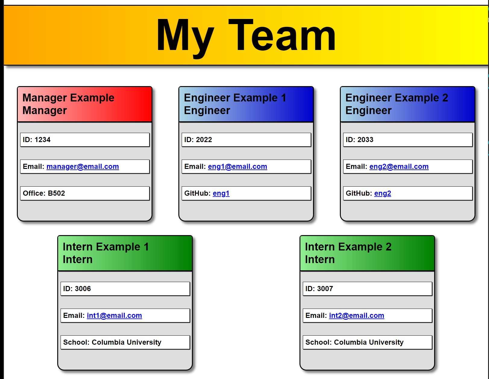

# Team Profile Generator

## Description

This app creates an html file containing information about a team of employees, laid out in an easy-to-view format to keep track of and share this information. The user can click on each team member's email to have that address pre-populated in the "to" section of their email program, and can click on any engineer's GitHub profile name to be directed in the browser to that employee's GitHub profile. The file is created through the command line by the user responding to prompts to populate the data.

## Usage

The user should open their command line terminal and run the application. They will be prompted to provide information about the employees on their team. They will be asked to select the role of the employee, their name, id, and email, and then if they are a manager - their office number, if they are an engineer - their GitHub profile name, and if they are an intern - their school. Once all the employees are entered the user can select "Finished" to end the program and generate the index.html file with their team's information, which they can view in their browser for viewing and/or sharing easily.

## Video Walkthrough

Please watch this video to see a walkthrough of the tests and usage of the application:
https://watch.screencastify.com/v/wQ1a5ntoIWti2H6l3ouJ

## License

MIT License

Copyright (c) 2022 Jackson Impellizeri

Permission is hereby granted, free of charge, to any person obtaining a copy
of this software and associated documentation files (the "Software"), to deal
in the Software without restriction, including without limitation the rights
to use, copy, modify, merge, publish, distribute, sublicense, and/or sell
copies of the Software, and to permit persons to whom the Software is
furnished to do so, subject to the following conditions:

The above copyright notice and this permission notice shall be included in all
copies or substantial portions of the Software.

THE SOFTWARE IS PROVIDED "AS IS", WITHOUT WARRANTY OF ANY KIND, EXPRESS OR
IMPLIED, INCLUDING BUT NOT LIMITED TO THE WARRANTIES OF MERCHANTABILITY,
FITNESS FOR A PARTICULAR PURPOSE AND NONINFRINGEMENT. IN NO EVENT SHALL THE
AUTHORS OR COPYRIGHT HOLDERS BE LIABLE FOR ANY CLAIM, DAMAGES OR OTHER
LIABILITY, WHETHER IN AN ACTION OF CONTRACT, TORT OR OTHERWISE, ARISING FROM,
OUT OF OR IN CONNECTION WITH THE SOFTWARE OR THE USE OR OTHER DEALINGS IN THE
SOFTWARE.
